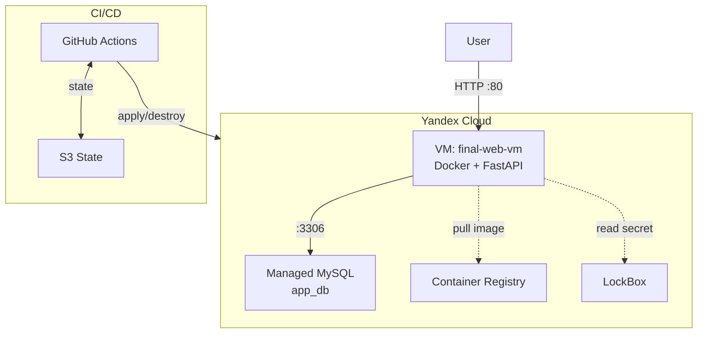
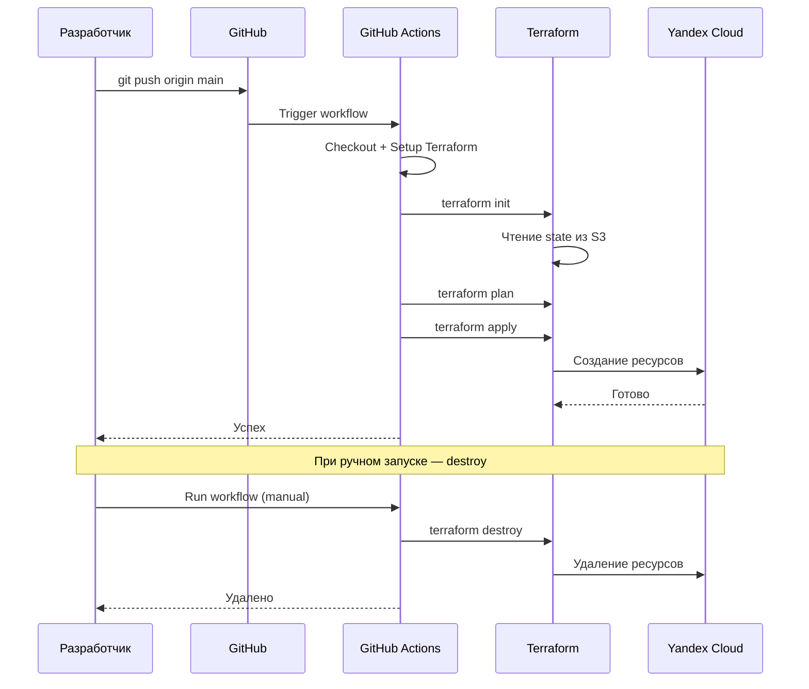

# Архитектура

## Компоненты

| Компонент | Описание |
|---|---|
| VPC `final` | Сеть `10.0.1.0/24` в зоне `ru-central1-a` |
| Security Group | Разрешает SSH (22), HTTP (80), HTTPS (443), MySQL (3306) |
| Managed MySQL | Кластер MySQL 8.0, `s2.micro`, 10 ГБ SSD |
| Container Registry | Хранит Docker-образ `app:latest` |
| VM | Ubuntu 22.04, Docker, Docker Compose, FastAPI-приложение |
| LockBox | Пароль от БД (опционально) |

## Поток данных

1. Пользователь открывает `http://<vm_ip>/`.
2. Uvicorn (FastAPI) принимает запрос на порту 5000 (снаружи — 80).
3. Приложение подключается к MySQL по FQDN из переменных окружения.
4. Выполняет `INSERT INTO requests` и возвращает время запроса.
5. Пользователь видит `TIME: ..., IP: None`.

## Схема

## CI/CD

## Сетевые порты

| Порт | Назначение | Источник |
|---|---|---|
| 22 | SSH | 0.0.0.0/0 |
| 80 | HTTP (FastAPI) | 0.0.0.0/0 |
| 443 | HTTPS | 0.0.0.0/0 |
| 3306 | MySQL | 10.0.1.0/24 (только VPC) |